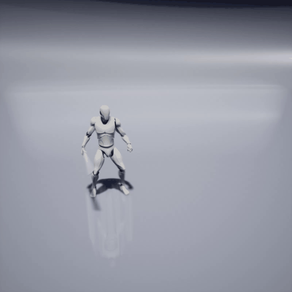
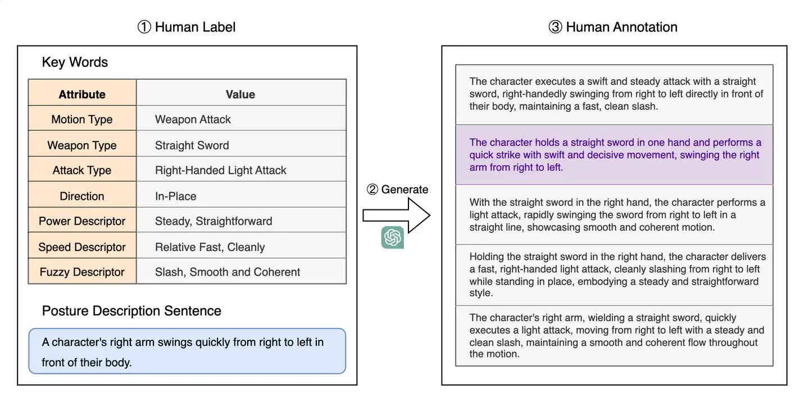

# GAMEMLD

GameMLD is a project focused on generating combat style character animations based on text. This project is trained on the [MotionGPT](https://github.com/OpenMotionLab/MotionGPT) and has produced the first character animation dataset dedicated to combat styles, named GameMLD, which comes with textual descriptions.

**Compare to current text-to-motion dataset**

| Dataset                                                      | Motions   | Texts      | Style      | Source         |
| ------------------------------------------------------------ | --------- | ---------- | ---------- | -------------- |
| [KIT-ML](https://motion-annotation.humanoids.kit.edu/dataset/) | 3,911     | 6,278      | Daily Life | Motion Capture |
| [HumanML3D](https://github.com/EricGuo5513/HumanML3D)        | 14,616    | 44,970     | Daily Life | Motion Capture |
| **GameMLD**                                                  | **8,700** | **26,100** | **Combat** | **Game**       |

Compared to the current text-to-motion datasets, GameMLD has the following characteristics:

1. Derived from game assets.
2. Features a fighting style, where the animation style in action games tends to be concentrated, and the types of actions are biased.
3. More detailed textual annotations.

## Dataset

###  Pipline

1. Obtain game assets in FBX format, redirect them to SMPL, and read the coordinates of human body joints (refer to [Fbx2SMPL](https://github.com/syan2018/Fbx2SMPL));

2. Add textual annotations. For each animation, manually annotate it from the following aspects: action type, weapon type, attack type, locational words, power descriptor words, speed descriptor words, and confusion descriptor words. A partial list of terms is shown below:

   | **Action  type** | **Weapon  type** | **Attack  type** | **Locative  words** | **Power**      | **Speed**     | **Fuzzy** |
   | ---------------- | ---------------- | ---------------- | ------------------- | -------------- | ------------- | --------- |
   | Idle             | Bare Hand        | Left-Handed      | In-Place            | Light-Weighted | Swift         | Piercing  |
   | Get Hit          | Sacred Seal      | Right-Handed     | Towards Left        | Steady         | Relative Fast | Slash     |
   | Death            | Fist             | One-Handed       | Towards Right       | Heavy-Weighted | Uniform Speed | Blunt     |
   | …                | …                | …                | …                   | …              | …             | …         |

   Then, use GPT-4 to combine these annotations into sentences.

   |  |  |
   | ------------------------------------- | ------------------------------------------- |

   The diagram above outlines our annotation process. Initially, we fill in seven key descriptive words based on the characteristics of the animation, followed by writing posture description sentences. Subsequently, we use a large language model to integrate these elements into several complete natural language sentences. Finally, we select the sentence that best meets our requirements as the annotation result.

3. Process the animation and annotated data into a format compatible with [HumanML3D](https://github.com/EricGuo5513/HumanML3D).


### GameMLD

Download: [google drive](https://drive.google.com/file/d/17tldNzQ2aFqwxwoqBAs4YqyDUnnPy8We/view?usp=drive_link)

GameMLD is a refined dataset that, in terms of character animation, retains 8,700 high-quality animations with a strong fighting style. In terms of textual annotations, we provide three text annotations for each animation: a concise description, a concise description with sensory details, and a detailed description.

For example, one of text annotations are:

```
weapon attack a man holding a Katana,executing a Charged Heavy Attack,Dual Wielding,root motion get Forward, Steady,Powerful and Relative Slow,First slow then fast,Cleanly.
weapon attack a man holding a Katana,executing a Charged Heavy Attack,Dual Wielding,root motion get Forward, Steady,Powerful and Relative Slow,First slow then fast,Cleanly,which make a sense of Piercing,Wide Open,Charged,Accumulating strength.
The character grips the wedge with both hands and charges for a powerful strike. They firmly lower their body, twist to the left, lunge forward with a bow step, and stab with the sword held in both hands.
```


## Model and Evaluation

Here are models trained on the GameMLD dataset using different algorithms:

- MotionGPT Model：[google drive](https://drive.google.com/file/d/1myqSqe41JpJCd0JaIu0FVPf93FI0A22L/view?usp=drive_link)
- MLD Model：[google drive](https://drive.google.com/file/d/161gtb0vZlitE6N4B2RrKETomnTPgOQmi/view?usp=drive_link)
- MDM Model：[google drive](https://drive.google.com/file/d/1Uzb2aFsQXq4Df3SBEc7cwXv8OobwDtto/view?usp=drive_link)

Download evaluator: [google drive](https://drive.google.com/file/d/1iL_PNRcgNzO5iiAgeypkeE9eJt67IpJa/view?usp=sharing)

**Evaluation on GameMLD**

| **Methods**  | MultiModal Distance ↓ | R-Precision (top 1)↑ | R-Precision (top 2)↑ | R-Precision(top 3)↑ | FID ↓       | Diversity →  | MultiModality ↑ |
| ------------ | --------------------- | -------------------- | -------------------- | ------------------- | ----------- | ------------ | --------------- |
| Ground Truth | 3.850±0.018           | 0.335±0.004          | 0.513±0.005          | 0.628±0.005         | 0.006±0.003 | 10.098±0.102 | /               |
| T2M          | 4.962±0.031           | 0.252±0.006          | 0.406±0.005          | 0.508±0.006         | 1.898±0.059 | 8.975±0.113  | 4.470±0.112     |
| T2M-GPT      | 3.701±0.027           | 0.353±0.005          | 0.545±0.006          | 0.663±0.005         | 0.177±0.016 | 10.128±0.132 | 1.798±0.041     |
| MDM          | 8.414±0.048           | 0.049±0.003          | 0.098±0.005          | 0.148±0.005         | 9.467±0.217 | 7.608±0.100  | 5.682±0.203     |
| MLD          | 4.331±0.029           | 0.293±0.004          | 0.459±0.003          | 0.568±0.004         | 0.628±0.038 | 9.741±0.093  | 3.035±0.138     |
| MMM          | 3.621±0.020           | 0.353±0.004          | 0.545±0.004          | 0.667±0.005         | 0.151±0.013 | 10.091±0.086 | 0.757±0.042     |
| MoMask       | 4.138±0.025           | 0.301±0.005          | 0.481±0.004          | 0.597±0.005         | 0.383±0.018 | 9.689±0.092  | 1.968±0.049     |
| MotionGPT    | 4.228±0.032           | 0.306±0.004          | 0.486±0.006          | 0.605±0.006         | 0.267±0.017 | 9.357±0.133  | 2.210±0.137     |

## Tutorial

- If you need to train a model, please download the [GameMLD dataset](https://drive.google.com/file/d/17tldNzQ2aFqwxwoqBAs4YqyDUnnPy8We/view?usp=drive_link). Then, follow the tutorials for [MotionGPT](https://github.com/OpenMotionLab/MotionGPT) or other text-to-motion algorithms to set up the environment and train your model.

- If you only need to use the AGPT model trained on the GameMLD dataset, please follow these steps:

  1. Set up the environment

     Our experimental environment is Ubuntu 22.04, NVIDIA GeForce RTX 4090, and CUDA 11.8

     ```
     git clone https://github.com/OpenMotionLab/MotionGPT.git
     cd MotionGPT
     conda create python=3.10 --name mgpt
     conda activate mgpt
     pip install -r requirements.txt
     python -m spacy download en_core_web_sm
     mkdir deps
     cd deps
     bash prepare/prepare_t5.sh
     bash prepare/download_t2m_evaluators.sh
     ```

  2. Download the [GameMLD dataset](https://drive.google.com/file/d/17tldNzQ2aFqwxwoqBAs4YqyDUnnPy8We/view?usp=drive_link)

     Unzip the dataset into the `datasets/humanml3d` directory.

     ```
     .
     └── humanml3d
         ├── new_joint_vecs
         ├── new_joints
         └── texts
     ```

  3. Generate animations using the model

     - Copy the `tools` folder and `config_AGPT.yaml` into the `MotionGPT` directory

     - Download the [AGPT model](https://drive.google.com/file/d/1myqSqe41JpJCd0JaIu0FVPf93FI0A22L/view?usp=drive_link), place it in the `MotionGPT` directory
     - Save the prompt in `input.txt`
     - Run `python demo.py --cfg ./config_AGPT.yaml --example ./input.txt`

     The generated result is `id_out.npy`, stored in `results/mgpt/debug--AGPT/`

  4. File format conversion

     - Convert the generated npy files to mp4 files: modify the file path in `tools/animation.py`, then run: `python animation.py`
     - Convert the generated npy files to bvh files: modify the file path in `tools/npy2bvh/joints2bvh.py`, then run: `python joints2bvh.py`
       Note: The code for npy2bvh is sourced from [Momask](https://github.com/EricGuo5513/momask-codes/blob/main/visualization/joints2bvh.py)

### Windows10 Tutorial

Use the AGPT model trained on the GameMLD dataset under Windows10:

- When configuring the environment for [MotionGPT](https://github.com/OpenMotionLab/MotionGPT/tree/0499f16df4ddde44dfd72a7cbd7bd615af1b1a94) (step 1), some packages may still be missing after using python=3.10.6 and installing requirements.txt, just follow the instructions to install them manually.

- Windows file path separator and linux are different, some path errors need to be changed to the Win system separator, such as the separator `'/'` change to `os.sep` in the [config.py](https://github.com/OpenMotionLab/MotionGPT/blob/0499f16df4ddde44dfd72a7cbd7bd615af1b1a94/mGPT/config.py#L17)

- Convert the generated npy files to mp4 files under python=3.10 environment may report errors. The matplotlib library requires version 3.3.3, but the minimum supported library version of cp310 is 3.5.0. If you use a library version higher than 3.5.0, you will encounter the following error:

  `ax.lines = [] AttributeError: can't set attribute`，

  `ax.collections = [] AttributeError: can't set attribute`，

  `ani.save "ValueError: unknown file extension: .mp4`.

If you encounter only the first two errors when executing with matplotlib>=3.5.0, you can refer to this issue https://github.com/GuyTevet/motion-diffusion-model/issues/6.

If you are also experiencing unrecognized mp4 files, you need to additionally download [ffmpeg](https://github.com/GyanD/codexffmpeg/releases/tag/2024-05-06-git-96449cfeae), unzip it and modify these contents in `tools/animation.py`:

```python
import matplotlib.pyplot as plt
plt.rcParams['animation.ffmpeg_path'] = r'D:\\ffmpeg\\bin\\ffmpeg.exe' #ffmpeg floder
from mpl_toolkits.mplot3d import Axes3D
```

If you have successfully generated a video file after resolving the error, but the video only has a white screen, please try switching to another python version to do the npy file format conversion. `tools/requirements.txt` provides the necessary dependencies for python=3.9.19 to work properly.

- The following problems may be encountered when converting the generated npy files to bvh files

  1. Some packages are missing or numpy is reporting errors. Prioritize using python=3.9.19 and install the dependencies in `tools/requirements.txt.`

  2. `tools/npy2bvh/joints2bvh.py` is missing some package imports. Add this code:

     ```python
     import matplotlib
     import matplotlib.pyplot as plt
     from mpl_toolkits.mplot3d.art3d import Poly3DCollection
     import mpl_toolkits.mplot3d.axes3d as p3
     ```

  3. `No such file or directory: './visualization/data/template.bvh'`. Modify the following path to use the commented out version:

     ```python
     self.template = BVH.load('./visualization/data/template.bvh', need_quater=True)
     #self.template = BVH.load(os.path.dirname(__file__) + '\\visualization\\data\\template.bvh', need_quater=True)
     ```

  4. `index 1 is out of bounds for axis 1 with size 1`. Make sure there is no `_in.npy` file in the path of the file you want to convert, just keep `_out.npy` to solve the problem.


## Suggestions

During the process of dataset creation and model training/tuning, you might encounter some issues in aspects like textual annotations, model training, and data augmentation. Based on our experience, we offer the following suggestions:

### Model Training Crashes Due to Errors in Textual Annotations

If you process data using the HumanML3D pipeline, you might encounter the following issues, which can lead to model training crashes:

- The textual description contains Chinese characters or Chinese punctuation.
- Some words fail to be successfully annotated with part-of-speech tags.
- Certain mathematical symbols, such as the degree symbol "°", are recognized as abnormal characters.

### Exploration of Textual Annotations

- Adding descriptions of root motion direction in the annotated text can help the model learn directional words.
- Adding frame number information to the annotated text does not enable the model to learn how to control the duration (or number of frames) of generation.
- The more detailed the textual annotations and the greater the number of different annotations for the same animation, the better the performance of the model.

### Mixed Training

Mixing the HumanML3D, KIT-ML, and GameMLD datasets for model training can result in significant improvements in evaluation metrics. 

However, evaluation metrics and visual effects are not equivalent. For some generated results, models trained on a mixed dataset perform worse than those trained solely on the GameMLD dataset. Because differences in action styles between datasets change the data distribution, thereby affecting model performance.

## Acknowledgments

- Algorithm: Thanks to [MotionGPT](https://github.com/OpenMotionLab/MotionGPT), [MLD](https://github.com/ChenFengYe/motion-latent-diffusion), [MDM](https://github.com/GuyTevet/motion-diffusion-model) and [Momask](https://github.com/EricGuo5513/momask-codes).
- Dataset: Thanks to [HumanML3D](https://github.com/EricGuo5513/HumanML3D) and [Motion-X](https://github.com/IDEA-Research/Motion-X).

Our code is partially borrowing from them.
